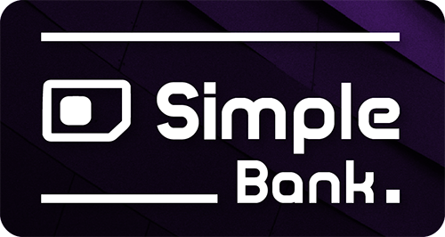

# SimpleBank 

**Name :** Simple.

**Ticker :** SPLB

**Algo :** Neoscrypt

**Blocktime :** 180 s

**Block 2 to 499 :** 1 SPLB / block

**Block 500 to ∞ :** 12 SPLB / block

**Target spacing :** 5 Block

**Masternodes collateral :** 2 000 SPLB

**Masternodes reward :** 65 % / block

**Max supply :** 21 000 000

**Premine :** 1.047 %

**Port :** 34445

__________________________________________________________________________

#### Open Source

Simple. obey to the Open-source principle. The SPLB code on is publicly display on Github.

#### High Security

Simple. is designed to be fast, secure and private. Based on Neoscrypt algorithm, transactions are confirm by a P2P GPU network sharing hashrate over the globe.

#### Anonymous

PrivateSend gives you true financial privacy by obscuring the origins of your funds. It allow you to mix your inputs with the inputs of two other people, without having your coins ever leave your wallet. You retain control of your money at all times.

#### Fast Transactions

InstantSend technology allow for cryptocurrencies such as Simple. to compete with nearly instantaneous transaction systems such as credit cards for point-of-sale situations while not relying on a centralized authority.

#### Asic Resistant

GPU based mining algorithm : SimpleBank use Neoscrypt for mining, an algorithm designed to be ASIC-resistant.

#### Difficulty retargeting

With Dark Gravity Wave mining difficulty is re-calculated every 5 blocks.

#### Masternodes

Masternodes enable support for PrivateSend and InstantSend and help to keep integrity of the network.

#### Air drop

Multiple airdrop campaigns will be scheduled to rewards Simple community.

__________________________________________________________________________

##### Website - http://simplebank.io/ 
##### Bitcointalk - https://bitcointalk.org/index.php?topic=3563816 
##### Discord - https://discord.gg/AcgDxYc 
##### Twitter - https://twitter.com/SimpleBankSoci1 
##### Nvidia Miner - https://github.com/KlausT/ccminer/releases 
##### Wallet - https://github.com/Simplebankdev/Simple./releases 
##### Explorer - http://explorer.simplebank.io/ 
##### Masternode scrypt and guide - https://github.com/Simplebankdev/simplevps
